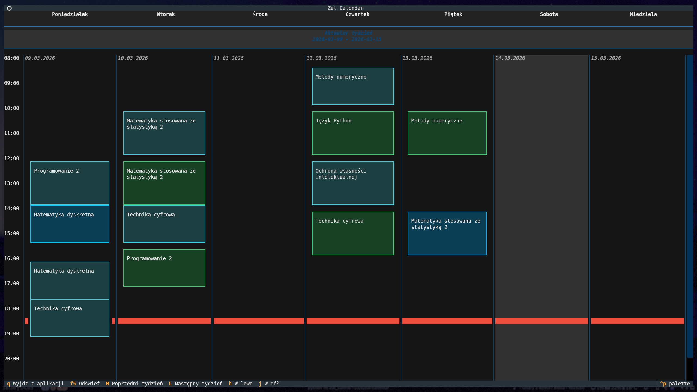

[](https://github.com/szymon-jozef/zut-calendar/actions/workflows/ci.yml)
[](https://www.python.org/downloads/)
[](https://www.gnu.org/licenses/gpl-3.0)
[](https://github.com/astral-sh/uv)
[](https://textual.textualize.io/)

# Zut Calendar TUI client

This project aims to improve the life of ZUT students that love the terminal!

If you're tired of checking `https://plan.zut.edu.pl/` every day and don't like classic calendar integration, it's something for you.

*state of project as of 11.03.2026 with class info redacted*


# Features
- Displaying schedule in a nice grid
- Remembering your student id (so already way nicer than the official site!)
- A bunch of themes, thanks to textual
- Ability to check different weeks
- Easy config with `.ini` file

# Supported platforms
It's Python so I guess it will work on anything. I develop and test this on NixOS, but from what I tested it should work on Windows too. I'm pretty sure macOS will work too, but I have no way of checking that, since I don't own a macbook…

# Install
## Nix
Primary way of installing this is using [nix flake](https://wiki.nixos.org/wiki/Flakes). To run this once just type:
```bash
nix run github:szymon-jozef/zut-calendar
```

If you want to install this type:
```bash
nix profile add github:szymon-jozef/zut-calendar
```

Or install this declaratively, by adding this to your flake

```nix
inputs = {
    zut-calendar.url = "github:szymon-jozef/zut-calendar";
};

outputs = { self, nixpkgs, zut-calendar, ... }: {
    nixosConfigurations."<your-hostname>" = nixpkgs.lib.nixosSystem {
        system = "x86_64-linux";
        modules = [
            ({ pkgs, ... }: {
                environment.systemPackages = [
                    zut-calendar.packages.${pkgs.system}.default
                ];
            })
        ];
    };
};
```
*you can do the same thing in home-manager if you want to…*

## Other Linux distros
Most Linux distros environments are externally managed by your package manager, so normal pip won't work. Download [pipx](https://github.com/pypa/pipx) and run
```bash
pipx install git+https://github.com/szymon-jozef/zut-calendar
```

## Windows
Just use normal pip
```bash
pip install git+https://github.com/szymon-jozef/zut-calendar
```
## macOS
I have no idea tbh, but pipx will probably work too.

# How to use?
Just type `zut-calendar` in the terminal.

There are some flags that you can check with `--help`

Everything else is set in the config file.

# Config
- On Unix-like systems config is stored in `$XDG_CONFIG_HOME/zut-calendar/config.ini`
- On Windows it's in `%LocalAppData%\szymon-jozef\zut-calendar\config.ini`

Example config is stored at `examples/config.ini`. It's copied to your config dir by default.
Entry names are pretty self-explanatory.

# Localisation
As of now this project supports English and Polish. Your language will be selected based on `$LANG`. If you want to overwrite it just set it before starting the program: `LANG=en zut-calendar`
*Windows sucks ass, so in order to change your language there you'll need to do something like this:*
```powershell
[Environment]::SetEnvironmentVariable("LANG", "pl_PL.UTF-8", "User")
```
*and restart your shell*

## Translating to other languages
1. Create a directory for your language: `mkdir -p src/zut_calendar/locales/<your-lang>/LC_MESSAGES`
2. Edit `update_lang.sh` to take into account your language. For example, if you want to add french (for whatever reason add these lines)
```bash
if $1 == "translate"
msgmerge -U src/zut_calendar/locales/fr/LC_MESSAGES/zut_calendar.po zut_calendar.pot
fi

if $1 == "gen"
    msgfmt -o src/zut_calendar/locales/fr/LC_MESSAGES/zut_calendar.mo src/zut_calendar/locales/fr/LC_MESSAGES/zut_calendar.po
fi
```
3. Run `./update_lang.sh translate`
4. Go into `src/zut_calendar/locales/<your-lang>/LC_MESSAGES/zut-calendar.pot` and translate everything.
5. Run `./update_lang.sh gen`
6. Make a PR
7. Enjoy!

*Keep in mind that translations only translate the app, not the data from API call, so you can't translate class entries*

# Info
This project is mostly finished, but will be developed further. If you want to, you can create an issue or make a PR.

# TODO
- [x] Proper grid layout with hours shown
- [x] Focusing, moving around and checking specific class info (kinda)
- [x] Checking other weeks than current
- [x] Good styles (i guess)
- [ ] Checking teachers schedule by name
- [x] Displaying week by dates

---
*Project inspired by [zutui](https://github.com/shv187/zutui)
